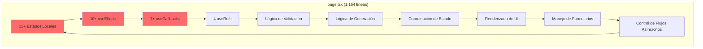
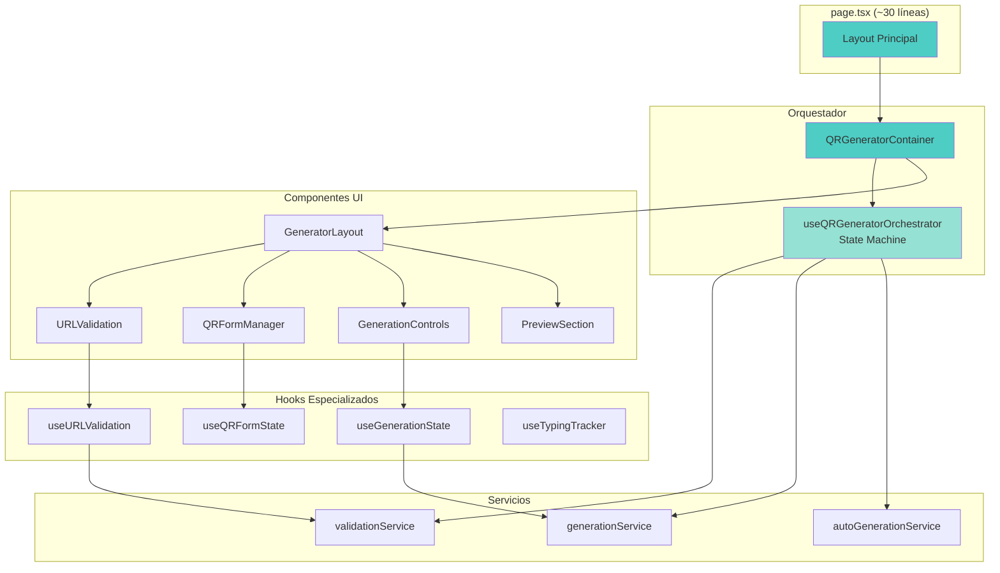

# 🏗️ Diagrama de Arquitectura: Actual vs Propuesta

## 📊 ARQUITECTURA ACTUAL (God Component)



### Problemas Identificados:
- 🔴 **Acoplamiento Extremo**: Todo está interconectado
- 🔴 **Responsabilidades Múltiples**: UI + Lógica + Estado + Coordinación
- 🔴 **Difícil de Testear**: No se pueden probar partes aisladas
- 🔴 **Propenso a Bugs**: Efectos pueden crear loops infinitos
- 🔴 **Mantenibilidad Pobre**: Cambiar algo puede romper todo

---

## ✨ ARQUITECTURA PROPUESTA (Componentes Modulares)



### Beneficios de la Nueva Arquitectura:

#### 🟢 **Separación de Responsabilidades**
- **page.tsx**: Solo layout y composición
- **QRGeneratorContainer**: Orquestación de componentes
- **State Machine**: Coordinación de flujos complejos
- **Componentes UI**: Solo presentación
- **Hooks**: Lógica reutilizable
- **Servicios**: Efectos secundarios aislados

#### 🟢 **Flujo de Datos Unidireccional**
```
User Input → Component → Hook → State Machine → Service → State Update → UI Update
```

#### 🟢 **Testing Simplificado**
- Cada componente testeable independientemente
- State machine con tests determinísticos
- Servicios mockeables
- Hooks testables con renderHook

---

## 🔄 MAPEO DE MIGRACIÓN

### handleQRFormChange (116 líneas) → Dividido en:
```
├── URLValidationInput.onChange()     (10 líneas)
├── useURLValidation.validate()       (20 líneas)
├── stateMachine.FORM_CHANGE action   (15 líneas)
├── validationService()               (20 líneas)
└── QRFormManager.updateField()       (10 líneas)
```

### useEffects (10+) → Convertidos a:
```
├── stateMachine.services
│   ├── initialGenerationService
│   ├── urlValidationService
│   └── autoGenerationService
└── Component lifecycle hooks
    ├── URLValidation.useEffect (debounce)
    └── PreviewSection.useEffect (animation)
```

### Estados (15+) → Organizados en:
```
├── stateMachine.context
│   ├── generation: { state, data, error }
│   ├── validation: { isValidating, result, metadata }
│   └── form: { type, data, options }
└── Component local state
    ├── URLValidation: inputValue
    └── GenerationControls: isDropdownOpen
```

### Refs (4) → Eliminados y reemplazados por:
```
├── stateMachine.context.lastValidatedUrl
├── stateMachine.context.hasGeneratedInitial
├── stateMachine.context.lastGeneratedData
└── stateMachine.timers (manejados internamente)
```

---

## 📈 MÉTRICAS DE MEJORA ESPERADAS

| Métrica | Actual | Propuesta | Mejora |
|---------|--------|-----------|---------|
| Líneas en page.tsx | 1,154 | ~30 | -97% |
| Complejidad Ciclomática | >20 | <5 | -75% |
| Acoplamiento | Alto | Bajo | ⬇️⬇️⬇️ |
| Cohesión | Baja | Alta | ⬆️⬆️⬆️ |
| Testabilidad | Difícil | Fácil | ⬆️⬆️⬆️ |
| Tiempo para nuevas features | Alto | Bajo | -60% |
| Riesgo de bugs | Alto | Bajo | -70% |

---

## 🎯 PRINCIPIOS APLICADOS

1. **Single Responsibility Principle (SRP)**
   - Cada componente tiene una sola razón para cambiar

2. **Open/Closed Principle (OCP)**
   - Abierto para extensión (nuevos tipos QR), cerrado para modificación

3. **Dependency Inversion Principle (DIP)**
   - Componentes dependen de abstracciones (hooks/servicios)

4. **Composition over Inheritance**
   - Componentes pequeños compuestos en lugar de herencia

5. **State Machine Pattern**
   - Estados explícitos y transiciones predecibles

---

## 🚀 PRÓXIMOS PASOS

1. ✅ **Backup realizado**
2. ✅ **Análisis de dependencias completado**
3. ✅ **Diagrama de arquitectura creado**
4. ⏳ **Escribir tests de regresión** (siguiente)
5. ⏳ **Setup nueva estructura de directorios**