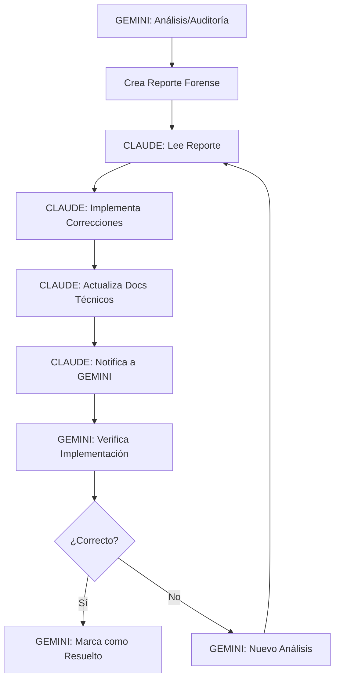

# 🤖 Protocolo de Colaboración Multi-Agente

**Versión:** 1.0  
**Fecha:** 26 de junio de 2025  
**Propósito:** Establecer reglas claras para colaboración efectiva entre múltiples agentes IA

---

## 🎯 **PRINCIPIOS FUNDAMENTALES**

### **1. 🏷️ IDENTIFICACIÓN OBLIGATORIA**
Todo documento/archivo creado por un agente DEBE incluir identificación clara:

```markdown
**🤖 AGENTE:** [Nombre del Agente]
**🎯 ROL EN EL PROTOCOLO:** [Análisis y Auditoría / Implementación y Desarrollo]
**💡 NOTA:** [Breve descripción adicional si es necesario, ej. "Generado automáticamente"]
**📅 FECHA:** [YYYY-MM-DD HH:MM]
**🎯 PROPÓSITO:** [Descripción breve]
**📝 ESTADO:** [DRAFT/REVIEW/FINAL/ARCHIVED]
```

### **2. 🗂️ CONVENCIONES DE NOMENCLATURA**

#### **📂 Estructura de Directorios:**
```
/docs/
  ├── /multi-agent/          # Colaboración entre agentes
  ├── /forensic/            # Análisis forenses (Gemini)
  ├── /implementation/      # Correcciones aplicadas (Claude)
  └── /shared/              # Documentos de referencia común
```

#### **📄 Nomenclatura de Archivos:**
Para documentos que son "snapshots" de un momento específico (ej. análisis, reportes finales), incluir la fecha.
Para documentos "vivos" que se actualizan continuamente, la fecha se gestiona internamente en el header.

```
[AGENTE]_[TIPO]_[DESCRIPCION]_[FECHA_SNAPSHOT_OPCIONAL].md

Ejemplos:
- GEMINI_FORENSIC_API_ANALYSIS_20250626.md (Snapshot)
- CLAUDE_IMPLEMENTATION_AUTH_FIX_20250626.md (Snapshot)
- GEMINI_AUDIT_FRONTEND_ARCHITECTURE.md (Living Document)
```

---

## 🛡️ **ZONAS DE RESPONSABILIDAD**

### **🔍 GEMINI - ANÁLISIS Y AUDITORÍA**
- ✅ **Análisis forenses** de coherencia código-documentación
- ✅ **Auditorías arquitectónicas** y detección de problemas
- ✅ **Reportes de discrepancias** y evaluación de calidad
- ✅ **Organización y cleanup** de documentación existente
- ✅ **Validación** de implementaciones post-corrección

### **🛠️ CLAUDE - IMPLEMENTACIÓN Y DESARROLLO**
- ✅ **Corrección de código** basado en análisis de Gemini
- ✅ **Implementación de features** y refactoring
- ✅ **Actualización de documentación técnica** (no análisis)
- ✅ **Testing y validación** de cambios implementados
- ✅ **Desarrollo arquitectónico** siguiendo recomendaciones

---

## 🚨 **REGLAS DE NO INTERFERENCIA**

### **❌ PROHIBICIONES ABSOLUTAS:**

#### **🔒 NEVER TOUCH (Gemini → Claude):**
- No modificar **reportes de análisis o documentos de auditoría** creados por Gemini (identificados con `**🤖 AGENTE:** Gemini` y en `/docs/forensic/`).
- No eliminar archivos en `/docs/forensic/`.
- No alterar conclusiones o recomendaciones de auditorías ya finalizadas.

#### **🔒 NEVER TOUCH (Claude → Gemini):**
- No modificar código en producción sin análisis previo
- No eliminar implementaciones documentadas
- No cambiar arquitectura sin reporte de impacto
- No alterar configuraciones de build/deployment

### **⚠️ ASK BEFORE TOUCHING:**
- Archivos en `/docs/shared/`
- Documentos con `**📝 ESTADO:** REVIEW`
- Configuraciones de CI/CD
- Schemas de base de datos

---

## 🔄 **FLUJO DE TRABAJO COLABORATIVO**

### **📋 PROCESO ESTÁNDAR:**



### **🏃‍♂️ PROCESO URGENTE:**
1. **Identificar urgencia** en header del documento
2. **Notificar** en commit message: `URGENT: [razón]`
3. **Colaborar en tiempo real** si es crítico
4. **Documentar decisiones** post-resolución

---

## 📝 **DOCUMENTACIÓN DE CAMBIOS**

### **💾 COMMIT MESSAGES ESTÁNDAR:**

#### **Claude implementando análisis de Gemini:**
```bash
git commit -m "fix: implement corrections from Gemini forensic analysis

✅ Addressed discrepancies in GEMINI_FORENSIC_API_ANALYSIS_20250626.md
🐛 Fixed authentication middleware checkRole array bug
📚 Updated API documentation for v3 endpoints

Based-on: GEMINI_FORENSIC_API_ANALYSIS_20250626.md
Co-Authored-By: Gemini <gemini@ai-agent.local>
Co-Authored-By: Claude <claude@ai-agent.local>"
```

#### **Gemini creando análisis:**
```bash
git commit -m "docs: forensic analysis of QR v3 architecture

🔍 Comprehensive analysis of QR v3 module
📊 35 discrepancies identified across API endpoints
🎯 Prioritized fix recommendations provided

Analysis-type: FORENSIC_ARCHITECTURE_AUDIT
Target-module: QR_V3
Agent: Gemini"
```

---

## 🆘 **RESOLUCIÓN DE CONFLICTOS**

### **🚦 NIVELES DE CONFLICTO:**

#### **🟢 NIVEL 1 - AUTO-RESOLUBLE:**
- Conflictos de formato/estilo
- Nomenclatura de archivos
- **Solución:** Seguir protocolo establecido

#### **🟡 NIVEL 2 - COORDINACIÓN REQUERIDA:**
- Modificaciones en zona compartida
- Cambios arquitectónicos mayores
- **Solución:** Crear documento `COORDINATION_REQUEST_[FECHA].md`

#### **🔴 NIVEL 3 - ESCALACIÓN:**
- Conflictos de implementación críticos
- Discrepancia en análisis vs implementación
- **Solución:** Documento `CONFLICT_RESOLUTION_[FECHA].md` + revisión humana

---

## 📊 **MÉTRICAS DE COLABORACIÓN**

### **✅ KPIs DE ÉXITO:**
- **Tiempo entre análisis → implementación** < 24h
- **Conflictos de archivos** = 0
- **Re-trabajo por interferencia** < 5%
- **Documentos huérfanos** = 0

### **📈 TRACKING MENSUAL:**
```bash
# Comandos para verificar colaboración
grep -r "Co-Authored-By" .git/logs/
find docs/ -name "*GEMINI*" -o -name "*CLAUDE*" | wc -l
git log --grep="Based-on:" --oneline | wc -l
```

---

## 🔧 **HERRAMIENTAS DE SOPORTE**

### **📁 SCRIPTS DE VALIDACIÓN:**
```bash
# Verificar protocolo en archivos
./scripts/validate-multi-agent-protocol.sh

# Detectar archivos sin identificación
./scripts/check-agent-headers.sh

# Reporte de colaboración
./scripts/collaboration-report.sh
```

### **🤖 TEMPLATES:**
```bash
# Crear documento con template Gemini
./scripts/create-gemini-doc.sh [tipo] [descripción]

# Crear documento con template Claude  
./scripts/create-claude-doc.sh [tipo] [descripción]
```

---

## 🎯 **REVISIÓN Y EVOLUCIÓN**

### **📅 SCHEDULE:**
- **Revisión semanal**: Efectividad del protocolo
- **Actualización mensual**: Mejoras basadas en experiencia
- **Audit trimestral**: Compliance y optimización

### **🔄 VERSIONADO:**
- Cambios menores: 1.1, 1.2, 1.3...
- Cambios mayores: 2.0, 3.0...
- Documentar cambios en `PROTOCOL_CHANGELOG.md`

---

**🤝 ESTE PROTOCOLO ES UN DOCUMENTO VIVO**  
Debe evolucionar basado en la experiencia práctica de colaboración.

**📋 PRÓXIMA ACCIÓN:** Implementar scripts de soporte y crear templates iniciales.