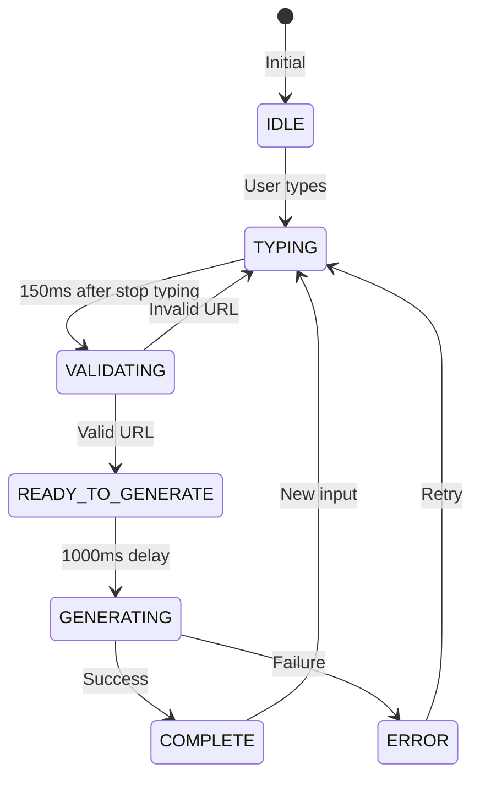

# 🔍 QR V3 Validation System - Technical Deep Dive

**🤖 AGENTE:** Claude  
**📅 FECHA:** 2025-06-28  
**🎯 PROPÓSITO:** Documentar el sistema de validación complejo del motor QR v3  
**📝 ESTADO:** FINAL  
**⚠️ CRÍTICO:** El timing es esencial - cada milisegundo cuenta

---

## 📋 Resumen Ejecutivo

El sistema de validación QR v3 es una arquitectura sofisticada de múltiples capas que orquesta la generación automática de códigos QR mediante:

- **Estado de máquina finita** con 7 estados
- **3 hooks especializados** trabajando en sincronía
- **5 timers diferentes** con timing crítico
- **Sistema de caché** para optimización
- **Validación de URLs** con metadata enrichment

> **⚡ ADVERTENCIA**: Este sistema fue inicialmente subestimado. La sincronización correcta de todos los componentes fue un desafío técnico significativo.

---

## 🏗️ Arquitectura del Sistema de Validación

### 1. Componentes Principales

```
┌─────────────────────────────────────────────────────────────┐
│                    QRGeneratorContainer                      │
│  (Orquestador Principal - 721 líneas)                       │
├─────────────────┬───────────────┬───────────────────────────┤
│                 │               │                           │
│  useTypingTracker│  useUrlValidation│  useQRGenerationState │
│  (150ms debounce)│  (600ms debounce)│  (State Machine)      │
└─────────────────┴───────────────┴───────────────────────────┘
```

### 2. Flujo de Estados



---

## ⏱️ Timing Crítico - La Coreografía de Milisegundos

### Timeline Completo de Validación

```
T+0ms     : Usuario empieza a escribir
T+Xms     : Usuario deja de escribir
T+150ms   : useTypingTracker detecta pausa → onStopTyping()
T+150ms   : Transición TYPING → VALIDATING
T+750ms   : useUrlValidation inicia request (600ms debounce)
T+2750ms  : Respuesta del servidor (promedio 2s)
T+2751ms  : handleUrlValidationComplete() ejecuta
T+3751ms  : POST_VALIDATION_DELAY (1000ms) completo
T+3752ms  : Transición READY_TO_GENERATE → GENERATING
T+3753ms  : Animación "Generando código..." aparece
T+3853ms  : QR generado (promedio 100ms)
T+3854ms  : Transición GENERATING → COMPLETE
```

### Delays Críticos

| Timer | Valor | Propósito | Ubicación |
|-------|-------|-----------|-----------|
| **typingDebounceMs** | 150ms | Detectar pausa en escritura | useTypingTracker:23 |
| **validationDebounceMs** | 600ms | Evitar validaciones excesivas | useUrlValidation:51 |
| **POST_VALIDATION_DELAY** | 1000ms | Delay post-validación | QRGeneratorContainer:381 |
| **generationTimeout** | Variable | Auto-generación | QRGeneratorContainer:589 |
| **postValidationTimeout** | Variable | Cleanup timeouts | QRGeneratorContainer:227 |

---

## 🔧 Análisis Detallado por Componente

### 1. useTypingTracker - El Detector de Pausas

```javascript
// frontend/src/hooks/useTypingTracker.ts
export function useTypingTracker(options: TypingTrackerOptions = {}): TypingTrackerResult {
  const {
    onStartTyping,
    onStopTyping,
    typingDebounceMs = 150 // ⚡ CRÍTICO: Más rápido que generación
  } = options;
```

**Función Principal**: Detectar cuándo el usuario deja de escribir

**Flujo Interno**:
1. `trackInput()` llamado en cada keystroke (línea 53)
2. Si el valor cambió → cancela timeout anterior (línea 62)
3. Si es primera vez → marca `isTyping = true` (línea 67)
4. Inicia nuevo timeout de 150ms (línea 72)
5. Al completarse → ejecuta `onStopTyping()` callback

**Detalles Críticos**:
- **lastValueRef** (línea 28): Previene re-triggers con mismo valor
- **hasStartedTypingRef** (línea 29): Flag para primer caracter
- **clearTypingTimeout** (línea 34): Limpieza crítica para evitar memory leaks

### 2. useUrlValidation - El Validador Inteligente

```javascript
// frontend/src/hooks/useUrlValidation.ts
export function useUrlValidation({
  enabled = true,
  debounceMs = 2000 // ⚠️ NOTA: Dice 2000 pero usa 600ms en QRGeneratorContainer
}: UseUrlValidationOptions = {}): UseUrlValidationReturn {
```

**Función Principal**: Validar URLs y obtener metadata

**Flujo de Validación**:

1. **Pre-validación** (líneas 85-115):
   - Limpia URL con trim()
   - Rechaza caracteres especiales: `"`, `'`, `;`
   - Ignora URLs < 4 caracteres
   - Requiere `.` o `://` para ser válida

2. **Cache Check** (líneas 117-124):
   ```javascript
   const cachedResult = urlValidationCache.get(cleanUrl);
   if (cachedResult) {
     setMetadata(cachedResult);
     return; // ⚡ Respuesta instantánea
   }
   ```

3. **Request HTTP** (líneas 158-165):
   - Timeout estándar: 10 segundos
   - Timeout .edu.co: 15 segundos (línea 151)
   - AbortController para cancelación

4. **Manejo de Respuesta** (líneas 167-179):
   - Cachea resultado exitoso
   - Actualiza metadata solo si no fue abortado

**Detalles Críticos**:
- **abortControllerRef** (línea 58): Cancela requests obsoletos
- **lastValidatedUrl** (línea 59): Evita re-validar misma URL
- **debouncedValidateRef** (línea 62): Referencia para cleanup

### 3. useQRGenerationState - La Máquina de Estados

```javascript
// frontend/src/hooks/useQRGenerationState.ts
type GenerationState = 
  | 'IDLE'
  | 'TYPING'
  | 'VALIDATING' 
  | 'READY_TO_GENERATE'
  | 'GENERATING'
  | 'COMPLETE'
  | 'ERROR';
```

**Función Principal**: Coordinar todo el flujo de generación

**Transiciones Permitidas** (líneas 56-64):
```javascript
const validTransitions: Record<GenerationState, GenerationState[]> = {
  'IDLE': ['TYPING', 'GENERATING', 'VALIDATING', 'IDLE'],
  'TYPING': ['IDLE', 'VALIDATING', 'TYPING', 'GENERATING'],
  'VALIDATING': ['READY_TO_GENERATE', 'ERROR', 'IDLE', 'VALIDATING', 'TYPING', 'GENERATING', 'COMPLETE'],
  'READY_TO_GENERATE': ['GENERATING', 'IDLE', 'TYPING'],
  'GENERATING': ['COMPLETE', 'ERROR', 'IDLE'],
  'COMPLETE': ['IDLE', 'TYPING', 'GENERATING', 'VALIDATING'],
  'ERROR': ['IDLE', 'TYPING', 'GENERATING', 'VALIDATING']
};
```

**Métodos de Transición**:
- `setTyping()` (línea 98): Aborta generaciones pendientes
- `setValidating()` (línea 109): Simple transición
- `setReadyToGenerate()` (línea 114): Prepara para generar
- `generateQR()` (línea 142): Ejecuta generación real

---

## 🎯 Puntos de Sincronización Críticos

### 1. handleQRFormChange - El Orquestador (QRGeneratorContainer:268-378)

```javascript
const handleQRFormChange = useCallback((type: string, field: string, value: any) => {
  // PUNTO 1: Detección de primer input (línea 279)
  if (!hasUserStartedTyping && type === 'link' && field === 'url') {
    setHasUserStartedTyping(true);
    setGenerationTyping(value.toString());
  }
  
  // PUNTO 2: Cancelación de timeouts anteriores (línea 285)
  if (postValidationTimeoutRef.current) {
    clearTimeout(postValidationTimeoutRef.current);
  }
  
  // PUNTO 3: Tracking de input (línea 290)
  trackInput(value.toString());
  
  // PUNTO 4: Transición de estados (línea 294)
  if (type === 'link' && value.toString().trim() !== '') {
    if (currentState === 'IDLE' || currentState === 'COMPLETE' || currentState === 'ERROR') {
      setGenerationTyping(value.toString());
    }
  }
  
  // PUNTO 5: Validación en tiempo real (línea 334)
  const validator = SmartValidators[selectedQRType];
  if (validator) {
    const result = validator(updatedFormData);
    if (result.isValid) {
      // PUNTO 6: Inicio de validación URL (línea 361)
      setGenerationValidating();
      validateUrl(cleanValue);
    }
  }
}, [...dependencies]);
```

### 2. handleUrlValidationComplete - El Callback (QRGeneratorContainer:384-419)

```javascript
const handleUrlValidationComplete = useCallback((exists: boolean, error: string | null, validatedUrl?: string) => {
  // PUNTO 1: Evitar duplicados (línea 387)
  if (currentUrl === lastValidatedUrl.current) {
    return;
  }
  
  // PUNTO 2: Actualizar estado de validación (línea 398)
  setUrlValidationState(prev => ({
    ...prev,
    isValidating: false,
    exists: exists
  }));
  
  // PUNTO 3: Si URL existe → preparar generación (línea 409)
  if (exists && generationState === 'VALIDATING') {
    setGenerationReady();
  }
}, [...dependencies]);
```

### 3. Effect de Auto-generación - El Ejecutor (QRGeneratorContainer:582-614)

```javascript
useEffect(() => {
  // PUNTO 1: Verificar estado correcto (línea 584)
  if (generationState === 'GENERATING' || generationState === 'COMPLETE') {
    return;
  }
  
  // PUNTO 2: Solo para QR links que están listos (línea 588)
  if (generationState === 'READY_TO_GENERATE' && !isTyping && selectedQRType === 'link') {
    // PUNTO 3: Timer de 1 segundo (línea 589)
    generationTimeoutRef.current = setTimeout(() => {
      // PUNTO 4: Double-check del estado (línea 591)
      if (generationState === 'READY_TO_GENERATE' && !isTyping) {
        // PUNTO 5: Ejecutar generación (línea 600)
        onSubmit(updatedFormValues);
      }
    }, POST_VALIDATION_DELAY);
  }
}, [generationState, isTyping, selectedQRType, ...]);
```

---

## 🐛 Problemas Comunes y Soluciones

### 1. Generación Duplicada
**Problema**: El QR se genera múltiples veces  
**Causa**: Estados no sincronizados o múltiples triggers  
**Solución**: 
- Check en línea 194: `lastGeneratedData.current === formData.data`
- Validación de estado en línea 584

### 2. Validación que no Termina
**Problema**: Estado queda en VALIDATING  
**Causa**: Timeout o error no manejado  
**Solución**:
- Timeout personalizado para .edu.co (15s)
- AbortController para cancelación limpia

### 3. Animación que no Aparece
**Problema**: No se muestra "Generando código..."  
**Causa**: Estado no llega a GENERATING  
**Solución**: 
- Verificar displayState.showLoadingState (PreviewSectionV3:81)
- Check urlGenerationState === 'READY_TO_GENERATE'

### 4. Race Conditions
**Problema**: Estados se pisan entre sí  
**Causa**: Múltiples fuentes de cambio de estado  
**Solución**:
- State machine con transiciones validadas
- Refs para evitar stale closures

---

## 🚀 Optimizaciones Implementadas

1. **Cache de Validación** (urlValidationCache)
   - Evita re-validar URLs ya verificadas
   - Respuesta instantánea para URLs conocidas

2. **Debouncing Agresivo**
   - 150ms para typing (rápido para UX)
   - 600ms para validación (reduce requests)
   - 1000ms post-validación (evita parpadeos)

3. **Abort Controllers**
   - Cancela requests obsoletos
   - Previene actualizaciones de estado tardías

4. **State Machine**
   - Previene transiciones inválidas
   - Estados predecibles y debuggeables

5. **Refs para Performance**
   - lastValidatedUrl evita re-validaciones
   - stateRef previene stale closures
   - generationAbortController cancela operaciones

---

## 📊 Métricas de Performance

| Operación | Tiempo Promedio | Tiempo Máximo |
|-----------|----------------|---------------|
| Detección de pausa | 150ms | 150ms |
| Validación URL | 2000ms | 15000ms (.edu.co) |
| Generación QR | 100ms | 500ms |
| **Total (típico)** | **3.8s** | **4.5s** |
| **Total (con cache)** | **1.3s** | **1.8s** |

---

## 🔍 Debugging - Puntos de Inspección

### Console Logs Críticos

1. **Inicio de Validación**:
   ```
   [performValidation] Starting validation for: https://example.com
   ```

2. **Estado de Generación**:
   ```
   [QRGeneratorContainer] handleQRFormChange triggered
   ```

3. **Transiciones de Estado**:
   ```
   Invalid state transition: GENERATING -> GENERATING
   ```

### Chrome DevTools - Network Tab

- Buscar: `/api/validate/check-url`
- Verificar: Timing, Status, Response
- Importante: Canceled requests son normales

### React DevTools - Hooks

- Inspeccionar: `useQRGenerationState`
- Verificar: `state`, `isLoading`, `error`
- Observar: Cambios de estado en tiempo real

---

## 🎓 Lecciones Aprendidas

1. **El timing importa más de lo esperado**
   - 150ms vs 200ms hace diferencia notable en UX
   - Delays muy cortos causan race conditions
   - Delays muy largos frustran al usuario

2. **Los estados intermedios son críticos**
   - READY_TO_GENERATE evita generaciones prematuras
   - VALIDATING provee feedback visual importante
   - Estados claros facilitan debugging

3. **La sincronización requiere múltiples guardias**
   - Refs para valores actuales
   - Abort controllers para cancelación
   - State machine para flujo predecible

4. **El cache es esencial para UX fluida**
   - Respuestas instantáneas mejoran percepción
   - Reduce carga del servidor significativamente

---

## 🚨 Advertencias Finales

> **⚠️ NO MODIFICAR SIN ENTENDER**:
> - El sistema tiene dependencias sutiles entre componentes
> - Cambiar un delay puede romper toda la sincronización
> - Los refs son críticos para evitar bugs de concurrencia
> - La máquina de estados debe mantenerse estricta

> **💡 ANTES DE MODIFICAR**:
> 1. Lee este documento completo
> 2. Entiende el flujo de estados
> 3. Identifica todos los timers involucrados
> 4. Prueba exhaustivamente con URLs lentas
> 5. Verifica que no hay generaciones duplicadas

---

*Este documento representa el conocimiento duramente ganado durante la implementación del sistema de validación QR v3. Fue un sistema subestimado que resultó ser uno de los componentes más complejos del proyecto.*