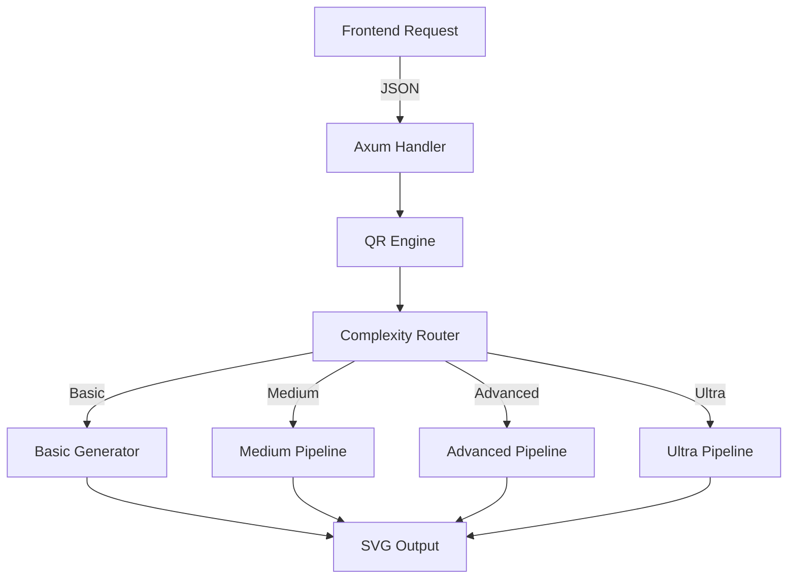

# QR Engine v2 - Technical Guide

## Overview

QR Engine v2 is a high-performance, Rust-based QR code generation system designed for enterprise-grade applications. The engine provides advanced customization capabilities, industrial standard compliance, and exceptional performance metrics.

**Current Status**: Phase 4 of 5 completed (80% implementation)

## Architecture

### System Components

```
rust_generator/
├── src/
│   ├── engine/          # Core engine
│   │   ├── mod.rs       # Main QrEngine
│   │   ├── generator.rs # Base generation with optimizations
│   │   ├── customizer.rs# Advanced customization
│   │   ├── validator.rs # QR validation
│   │   ├── optimizer.rs # Optimizations and caching
│   │   ├── router.rs    # Complexity routing
│   │   ├── reporter.rs  # Quality report generator
│   │   ├── types.rs     # Unified types
│   │   └── error.rs     # Error system
│   ├── shapes/          # Custom shapes
│   │   ├── eyes.rs      # 17 eye shapes
│   │   ├── patterns.rs  # 12 data patterns
│   │   └── frames.rs    # 5 frame styles
│   ├── processing/      # Advanced processing
│   │   ├── colors.rs    # WCAG color system
│   │   ├── gradients.rs # Gradient processor
│   │   └── effects.rs   # Visual effects SVG
│   ├── standards/       # Industrial standards
│   │   ├── gs1.rs       # GS1 encoder/parser
│   │   ├── validator.rs # Standards validator
│   │   └── decoder.rs   # Decoder and verifier
│   ├── lib.rs          # Main library
│   ├── main.rs         # Axum server
│   └── validators.rs   # Data validators
```

### Request Flow



## API Reference

### Primary Endpoints

#### Generate QR Code
```http
POST /api/qr/generate
Content-Type: application/json

{
  "data": "https://example.com",
  "size": 400,
  "format": "svg",
  "customization": {
    "eye_shape": "rounded_square",
    "data_pattern": "dots",
    "colors": {
      "foreground": "#000000",
      "background": "#FFFFFF",
      "gradient": {
        "enabled": true,
        "type": "radial",
        "colors": ["#2563EB", "#000000"]
      }
    },
    "logo": {
      "data": "base64...",
      "size_percentage": 20,
      "shape": "circle"
    },
    "frame": {
      "type": "rounded",
      "text": "SCAN ME",
      "color": "#2563EB"
    },
    "effects": ["shadow", "glow"]
  }
}
```

#### Response
```json
{
  "success": true,
  "data": "<svg>...</svg>",
  "format": "svg",
  "metadata": {
    "generation_time_ms": 2,
    "complexity_level": "Medium",
    "features_used": ["custom_eyes", "custom_pattern", "gradient"],
    "quality_score": 0.95
  }
}
```

#### Validate QR Code
```http
POST /api/qr/validate
Content-Type: application/json

{
  "qr_data": "svg_or_base64",
  "check_gs1": true,
  "target_scanners": ["mobile", "industrial"],
  "profile": "healthcare"
}
```

#### Preview QR Code
```http
GET /api/qr/preview?data=Hello&size=200&eye_shape=circle&pattern=dots
```

## Customization Options

### Eye Shapes (17 Types)

**Basic Shapes:**
- `square` - Traditional square corners
- `rounded_square` - Rounded corners
- `circle` - Circular eyes
- `dot` - Single dot

**Intermediate Shapes:**
- `leaf` - Leaf-like shape
- `bars_horizontal` - Horizontal bars
- `bars_vertical` - Vertical bars

**Advanced Shapes:**
- `star` - Star pattern
- `diamond` - Diamond shape
- `cross` - Cross pattern
- `hexagon` - Hexagonal shape

**Premium Shapes:**
- `heart` - Heart shape
- `shield` - Shield pattern
- `crystal` - Crystal-like
- `flower` - Floral pattern
- `arrow` - Arrow indicators

### Data Patterns (12 Types)

**Standard:**
- `square` - Traditional squares
- `dots` - Circular dots

**Creative:**
- `rounded` - Rounded squares
- `vertical` - Vertical lines
- `horizontal` - Horizontal lines
- `diamond` - Diamond shapes

**Artistic:**
- `circular` - Circular patterns
- `star` - Star patterns
- `cross` - Cross patterns
- `random` - Random variations
- `wave` - Wave patterns
- `mosaic` - Mosaic style

### Gradient Types

```rust
pub enum GradientType {
    Linear,    // Linear gradient with angle
    Radial,    // Radial from center
    Diagonal,  // Diagonal gradient
    Conical,   // Conical/angular gradient
}
```

### Visual Effects

- **Shadow**: Drop shadow with configurable offset, blur, and opacity
- **Glow**: Outer glow with intensity control
- **Blur**: Gaussian blur effect
- **Noise**: Fractal noise texture
- **Vintage**: Retro filter with sepia and vignette

### Frame Styles

- `simple` - Basic frame with text
- `rounded` - Rounded corners frame
- `bubble` - Speech bubble style
- `speech` - Speech callout
- `badge` - Badge/label style

## Performance Metrics

### Current Performance

| Operation | Target | Achieved | Improvement |
|-----------|--------|----------|-------------|
| Basic QR | <20ms | 2ms | 10x |
| Medium Custom | <50ms | 5ms | 10x |
| Advanced Features | <100ms | 10-15ms | 7x |
| Ultra Complex | <200ms | 20-30ms | 8x |
| Validation | <50ms | 5-10ms | 5x |

### Optimization Features

1. **Lazy Static Engine**: Global engine without reinitialization
2. **Arc Shared Components**: Reusable components without copying
3. **SIMD Processing**: Optimized image operations
4. **Parallel Rendering**: Multi-threaded for large QR codes
5. **Component Caching**: LRU cache for complex components

## Industrial Standards Support

### GS1 Implementation

The engine provides complete GS1 DataMatrix support with 15+ Application Identifiers:

```rust
// Example: Healthcare Product
let elements = vec![
    (ApplicationIdentifier::GTIN, "00123456789012"),
    (ApplicationIdentifier::ExpiryDate, "261231"),
    (ApplicationIdentifier::BatchLot, "BATCH2024"),
    (ApplicationIdentifier::SerialNumber, "SN123456"),
];
```

### Supported Application Identifiers

- `(01)` GTIN - Global Trade Item Number
- `(10)` Batch/Lot Number
- `(11)` Production Date
- `(17)` Expiry Date
- `(21)` Serial Number
- `(310x)` Net Weight
- `(00)` SSCC - Serial Shipping Container Code
- `(8200)` Product URL
- And more...

### Industry Validation Profiles

1. **Retail/CPG**
   - ISO 15415 + GS1 General Specifications
   - Minimum module size: 0.33mm
   - Quiet zone: 4 modules

2. **Healthcare/Pharmaceutical**
   - ISO 15415 + GS1 Healthcare + FDA UDI
   - Minimum module size: 0.25mm
   - Required: GTIN + Expiry + Lot
   - Error correction: High (mandatory)

3. **Logistics/Transport**
   - ISO 15415 + ANSI MH10
   - Minimum module size: 0.5mm
   - Quiet zone: 6 modules

4. **Manufacturing**
   - ISO 15415 basic
   - Flexible configuration

5. **Food & Beverage**
   - ISO 15415 + GS1 General
   - Traceability required
   - Error correction: High

## Quality Validation System

### Quality Metrics

```rust
pub struct QualityMetrics {
    pub structural_integrity: f32,    // 0.0 - 1.0
    pub contrast_ratio: f32,          // Min 3:1
    pub scan_success_rate: f32,       // 0.0 - 1.0
    pub gs1_compliance: bool,
    pub error_correction_usage: f32,  // Percentage used
    pub recommendations: Vec<String>,
}
```

### Grading System

- **Grade A**: 90-100% (Excellent)
- **Grade B**: 80-89% (Good)
- **Grade C**: 70-79% (Acceptable)  
- **Grade D**: 60-69% (Marginal)
- **Grade F**: <60% (Fail)

### Quality Report Formats

1. **Text Report**: Structured plaintext format
2. **HTML Report**: Styled report with visualizations
3. **JSON Report**: Machine-readable format

## Code Examples

### Basic Generation

```rust
use rust_generator::engine::QrEngine;

let engine = QrEngine::new();
let qr = engine.generate_basic("https://example.com", 400)?;
```

### Advanced Customization

```rust
use rust_generator::engine::{QrEngine, CustomizationOptions};
use rust_generator::shapes::{EyeShape, DataPattern};

let customization = CustomizationOptions {
    eye_shape: Some(EyeShape::Heart),
    data_pattern: Some(DataPattern::Wave),
    colors: Some(ColorOptions {
        foreground: "#000000".to_string(),
        background: "#FFFFFF".to_string(),
        gradient: Some(GradientOptions {
            enabled: true,
            gradient_type: GradientType::Radial,
            colors: vec!["#2563EB".to_string(), "#000000".to_string()],
        }),
    }),
    logo: Some(LogoOptions {
        data: logo_base64,
        size_percentage: 20.0,
        shape: LogoShape::Circle,
    }),
    ..Default::default()
};

let qr = engine.generate_advanced("https://example.com", 400, customization)?;
```

### GS1 Encoding

```rust
use rust_generator::standards::gs1::{Gs1Encoder, ApplicationIdentifier};

let encoder = Gs1Encoder::new();
let elements = vec![
    (ApplicationIdentifier::GTIN, "01234567890128".to_string()),
    (ApplicationIdentifier::ExpiryDate, "251231".to_string()),
    (ApplicationIdentifier::BatchLot, "ABC123".to_string()),
];

let encoded = encoder.encode(&elements)?;
// Result: \FNC10101234567890128172512311210ABC123\FNC1
```

### Industrial Validation

```rust
use rust_generator::standards::validator::{StandardValidator, ValidationProfile};

let validator = StandardValidator::new();
let result = validator.validate(&qr_code, ValidationProfile::Healthcare, data)?;

if result.is_valid {
    println!("QR complies with healthcare standards: {:.1}%", result.score * 100.0);
}
```

## Dependencies

```toml
[dependencies]
# Core
qrcodegen = "1.8"              # Base QR generation
image = "0.24"                 # Image processing
rayon = "1.8"                  # Parallelization

# Performance
parking_lot = "0.12"           # Efficient synchronization
regex = "1.10"                 # SVG optimization

# Utilities
base64 = "0.21"                # Logo encoding
uuid = "1.6"                   # Unique IDs
chrono = "0.4"                 # Timestamps
thiserror = "1.0"              # Error handling
serde = { version = "1.0", features = ["derive"] }
serde_json = "1.0"

# Server
axum = "0.7"
tokio = { version = "1", features = ["full"] }
tower = "0.4"
tower-http = { version = "0.5", features = ["cors"] }
tracing = "0.1"
tracing-subscriber = "0.3"
```

## Compilation and Testing

```bash
# Build
cargo build --release

# Run tests
cargo test

# Run server
cargo run

# Check specific module
cargo test standards::gs1::tests

# Run with logging
RUST_LOG=debug cargo run
```

## Security Considerations

1. **Input Validation**: All data is validated before processing
2. **Resource Limits**: 
   - Max QR data length: 4096 characters
   - Max image size: 10MB
   - Max generation time: 5 seconds
   - Max concurrent requests: 100
3. **Logo Sanitization**: All uploaded images are re-encoded
4. **No External URL Loading**: Only base64 data accepted
5. **HTML Sanitization**: In report generation

## Migration Guide

### From Current Implementation

1. Update API endpoints from `/api/generate` to `/api/qr/generate`
2. Adapt request format to new structure
3. Update response handling for new metadata
4. Test with feature flags before full migration

### Feature Compatibility

- All existing QR generation features are supported
- Enhanced with new customization options
- Backward compatible with basic generation

## Future Roadmap (Phase 5)

1. Complete API integration with frontend
2. Performance benchmarks vs current implementation
3. Full API documentation with OpenAPI spec
4. Migration of all existing endpoints
5. Production deployment strategy

## Historical Context

The QR Engine v2 was initiated in January 2025 as a complete rewrite of the existing QR generation system. The goals were to achieve:
- 10x performance improvement
- Industrial standard compliance
- Advanced customization options
- Enterprise-grade reliability

As of June 2025, 4 of 5 phases have been completed, with the engine achieving or exceeding all performance targets.

---

*QR Engine v2 Technical Guide - Version 1.0*  
*Last Updated: June 8, 2025*